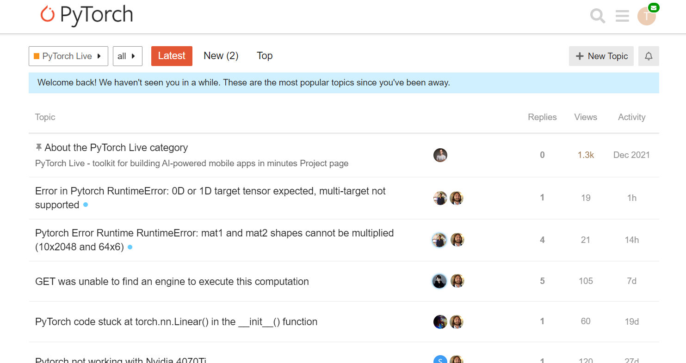
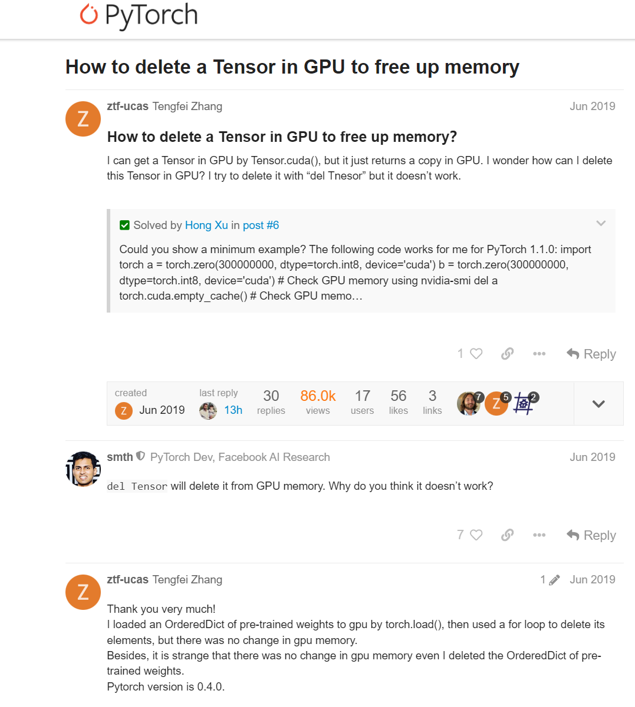

# chats-crawler

<div align="center">
    
[](LICENSE)

English | [简体中文](README_zh.md)
</div>
<!-- # chats-crawler -->
Discourse chat data crawling and parsing for LLM instruction finetuning. Data include the texts, images (crucial for multimodal finetuning) and links. Will support more than Discourse-based websites soon.

## Table of Contents

- [Quick Start](#quick-start)
- [Notice](#notice)
- [Future Work](#future-work)
- [License](#license)
- [Citation](#citation)
- [Acknowledgement](#acknowledgement)
## Quick Start
Run
```bash
git clone https://github.com/jackfsuia/chats-crawler.git
```
Then install the requirements, run
```bash
npm i
```
Before crawling, please read the [Notice](#Notice). Config the target website at [config.ts](config.ts), edit the `url` and `rex` properties to match your needs, i.e., replace the two `https://discuss.pytorch.org`s there with your target [**Discourse-based**](https://github.com/discourse/discourse) website. A [**Discourse-based**](https://github.com/discourse/discourse) website basically all looks like this:



To start crawling, run
```bash
npm start
```
That's all! The discourse chat data are saved at `storage/datasets/default` as .json files, and the images at `storage/datasets/imgs`.
## Examples
Lets say we crawling https://discuss.pytorch.org. We should edit the [config.ts](config.ts) as:
```
...
 url: "https://discuss.pytorch.org/",
...
rex: "https://discuss.pytorch.org/t/[^/]+/[0-9]+$",
```
One of the chat page we have crawled might be this one:



then at one of the .json files in `storage/datasets/default`, the `"conversations"` property inside will be
```
<# ztf-ucasTengfei Zhang #>:
How to delete a Tensor in GPU to free up memory？
I can get a Tensor in GPU by Tensor.cuda(), but it just returns a copy in GPU. I wonder how can I delete this Tensor in GPU? I try to delete it with “del Tnesor” but it doesn’t work.


              Quote:"
                Could you show a minimum example? The following code works for me for PyTorch 1.1.0:
import torch
a = torch.zero(300000000, dtype=torch.int8, device='cuda')
b = torch.zero(300000000, dtype=torch.int8, device='cuda')
# Check GPU memory using nvidia-smi
del a
torch.cuda.empty_cache()
# Check GPU memo…
              "

<# smth #>:
del Tensor will delete it from GPU memory. Why do you think it doesn’t work?7
<# ztf-ucasTengfei Zhang #>:
Thank you very much!
I loaded an OrderedDict of pre-trained weights to gpu by torch.load(), then used a for loop to delete its elements, but there was no change in gpu memory.
Besides, it is strange that there was no change in gpu memory even I deleted the OrderedDict of pre-trained weights.
Pytorch version is 0.4.0.2
```
`<# ztf-ucasTengfei Zhang #>` and `<# smth #>` are the two posters' names, and are formatted this way for you to easily further template it to train LLMs (e.g., maybe replace `<# smth #>` with `<assistant>`, and `<# ztf-ucasTengfei Zhang #>` with `<user>`, etc.).
## Notice
Make sure by yourself the crawling is **legal**, check the website's robots.txt if you're not sure. We are not responsible for any law risks and issues.

## Future Work
- Support image data auto OCR to texts, then inserted among original texts data. It makes the data complete in text form, and save some space too if OCR happens when on the crawling, not post crawling.
  
## License

chats-crawler is licensed under the Apache 2.0 License found in the [LICENSE](LICENSE) file in the root directory of this repository.

## Citation

If this work is helpful, please kindly cite as:

```bibtex
@article{chats-crawler,
  title={chats-crawler: discourse chat data crawling and parsing for LLM instruction finetuning.}, 
  author={Yannan Luo},
  year={2024},
  url={https://github.com/jackfsuia/chats-crawler}
}
```
## Acknowledgement

Learned a lot from [gpt-crawler](https://github.com/BuilderIO/gpt-crawler) and [crawlee](https://github.com/apify/crawlee). Thanks for their wonderful works.
